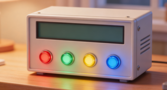

# OneCube


OneCube is an Arduino-based project that demonstrates control of LEDs, a buzzer, and an I2C LCD display. The project provides a modular structure for managing hardware components and displaying system information.

## Features

- **LED Control:** Manage four LEDs (Red, Green, Yellow, Blue) with simple color setting and turn-off functions.
- **Buzzer Control:** Generate beeps at different frequencies and durations.
- **LCD Display:** Show messages, CPU/memory usage, temperature/humidity, IP address, and a real-time clock (since a fixed start date).

## Hardware Requirements

- Arduino board (Uno, Mega, etc.)
- 1602 I2C LCD display (default address: `0x27`)
- 4 LEDs (Red, Green, Yellow, Blue)
- 1 Buzzer
- Jumper wires and breadboard

## Pin Configuration

| Component  | Pin |
| ---------- | --- |
| Red LED    | 2   |
| Green LED  | 3   |
| Yellow LED | 5   |
| Blue LED   | 4   |
| Buzzer     | 6   |

## File Structure

```
src/
  ├── main.cpp           # Main Arduino sketch
  ├── LEDControl.cpp     # LED control implementation
  ├── BeepControl.cpp    # Buzzer control implementation
  ├── LCDControl.cpp     # LCD display implementation
include/
  ├── LEDControl.h
  ├── BeepControl.h
  ├── LCDControl.h
```

## Usage

1. **Wiring:** Connect the LEDs and buzzer to the specified pins. Connect the LCD via I2C.
2. **Build and Upload:** Open the project in the Arduino IDE or PlatformIO, select your board, and upload.
3. **Operation:** On startup, the system will:
    - Display a welcome message on the LCD.
    - Cycle through LED colors.
    - Play beeps at different frequencies.
    - Continuously display the date and time since July 1, 2025.

## Customization

- Modify `main.cpp` to change the displayed information or add new features.
- Use the provided methods in `LCDControl` to display custom messages or sensor data.

---

## Serial Control Protocol

**Baud rate:** `115200`
**Frame format:**

```
[AA][55][LEN][CMD][PAYLOAD × LEN][CHKSUM][0D][0A]
```

- `AA 55` — fixed header
- `LEN` — number of payload bytes (0–32)
- `CMD` — command byte
- `CHKSUM` — `LEN ^ CMD ^ PAYLOAD[0] ^ … ^ PAYLOAD[N-1]` (XOR)
- `0D 0A` — fixed footer (CR LF)

Every command returns an **ACK frame** with the same `CMD` byte and a payload starting with a status byte:

| Status           | Value | Meaning            |
| ---------------- | ----- | ------------------ |
| `STATUS_OK`      | `00`  | Success            |
| `STATUS_ERROR`   | `01`  | General error      |
| `STATUS_INVALID` | `02`  | Invalid parameters |

---

### Command Reference

#### `0x01` PING
Test communication.

| Dir      | Payload  |
| -------- | -------- |
| → Device | *(none)* |
| ← ACK    | `[00]`   |

**Example:** `AA 55 00 01 01 0D 0A`

---

#### `0x02` GET_STATUS
Query firmware version, LED state, and uptime.

| Dir      | Payload                                      |
| -------- | -------------------------------------------- |
| → Device | *(none)*                                     |
| ← ACK    | `[00, fw_ver, led_mask, up3, up2, up1, up0]` |

- `fw_ver` — firmware version (`01`)
- `led_mask` — current LED bitmask (R=bit0, G=bit1, Y=bit2, B=bit3)
- `up3..up0` — uptime in seconds, big-endian uint32

**Example:** `AA 55 00 02 02 0D 0A`

---

#### `0x03` SET_LED
Turn one or more LEDs on/off immediately (clears any active blink).

| Dir      | Payload         |
| -------- | --------------- |
| → Device | `[mask, state]` |
| ← ACK    | `[00]`          |

**LED bit masks:**

| Bit | Mask | LED    |
| --- | ---- | ------ |
| 0   | `01` | Red    |
| 1   | `02` | Green  |
| 2   | `04` | Yellow |
| 3   | `08` | Blue   |
| —   | `0F` | All    |

`state`: `01` = ON, `00` = OFF

**Examples:**
```
# Turn Red ON
AA 55 02 03 01 01 01 0D 0A

# Turn all LEDs OFF
AA 55 02 03 0F 00 0E 0D 0A
```

---

#### `0x04` SET_BEEP
Start a beep pattern or stop the buzzer.

| Dir             | Payload                                 |
| --------------- | --------------------------------------- |
| → Device (play) | `[fH, fL, onH, onL, offH, offL, count]` |
| → Device (stop) | `[00]`                                  |
| ← ACK           | `[00]`                                  |

- `fH:fL` — frequency in Hz (big-endian uint16)
- `onH:onL` — ON duration ms (big-endian uint16)
- `offH:offL` — OFF duration ms (big-endian uint16)
- `count` — repeat count (≥ 1)

**Examples:**
```
# Beep at 1000 Hz, 200 ms on, 200 ms off, 3 times
AA 55 07 04 03 E8 00 C8 00 C8 03 B7 0D 0A

# Stop beep
AA 55 01 04 00 05 0D 0A
```

---

#### `0x05` GET_AI
Read an analog input pin (A0–A5), returns 0–1023.

| Dir      | Payload            |
| -------- | ------------------ |
| → Device | `[pin]` pin: 0–5   |
| ← ACK    | `[00, valH, valL]` |

**Example (read A0):** `AA 55 01 05 00 04 0D 0A`

---

#### `0x06` LCD_DISPLAY
Write text at a specific position on the LCD.

| Dir      | Payload                  |
| -------- | ------------------------ |
| → Device | `[row, col, len, text…]` |
| ← ACK    | `[00]`                   |

- `row`: 0–1
- `col`: 0–15
- `len`: number of text bytes (≤ 13 to stay safe)

After this command the LCD stays host-controlled for **30 seconds** before returning to uptime display.

**Example (row 0, col 0, "Hello"):**
```
AA 55 08 06 00 00 05 48 65 6C 6C 6F 60 0D 0A
```

---

#### `0x07` LCD_CLEAR
Clear the LCD screen.

| Dir      | Payload  |
| -------- | -------- |
| → Device | *(none)* |
| ← ACK    | `[00]`   |

**Example:** `AA 55 00 07 07 0D 0A`

---

#### `0x08` GET_TIME
Read device uptime in seconds.

| Dir      | Payload                    |
| -------- | -------------------------- |
| → Device | *(none)*                   |
| ← ACK    | `[00, up3, up2, up1, up0]` |

**Example:** `AA 55 00 08 08 0D 0A`

---

#### `0x09` SET_BLINK
Start a non-blocking LED blink pattern.

| Dir      | Payload                               |
| -------- | ------------------------------------- |
| → Device | `[mask, onH, onL, offH, offL, count]` |
| ← ACK    | `[00]`                                |

- `count = 00` → blink indefinitely

**Example (Red blink 500 ms/500 ms, infinite):**
```
AA 55 06 09 01 01 F4 01 F4 00 EC 0D 0A
```

---

#### `0x0A` STOP_BLINK
Stop blinking and turn off the selected LEDs.

| Dir      | Payload  |
| -------- | -------- |
| → Device | `[mask]` |
| ← ACK    | `[00]`   |

**Example (stop Red blink):**
```
AA 55 01 0A 01 0A 0D 0A
```

---

### Checksum Calculator

```
CHKSUM = LEN ^ CMD ^ PAYLOAD[0] ^ PAYLOAD[1] ^ … ^ PAYLOAD[N-1]
```

Quick Python helper:
```python
def make_frame(cmd, payload=b''):
    length = len(payload)
    cs = length ^ cmd
    for b in payload:
        cs ^= b
    return bytes([0xAA, 0x55, length, cmd]) + payload + bytes([cs, 0x0D, 0x0A])

# Example: PING
print(make_frame(0x01).hex(' ').upper())  # AA 55 00 01 01 0D 0A
```

---

## License

This project is for educational and